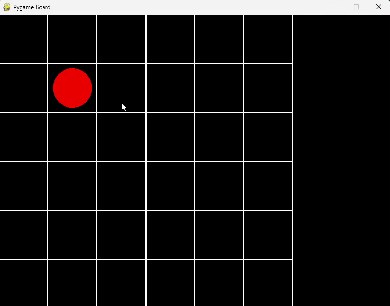

# Genetic-MiniMax
Approximating Fourier Coefficients Using Genetic Algorithm + Implementing Pentago game with MiniMax Algorithm

## 🧬 Part 1: Approximating Fourier Coefficients Using Genetic Algorithm

**Objective:**  
Estimate the Fourier series coefficients of an unknown function using a genetic algorithm.

**Preview** of one of the comparison plots: 

## 🎮 Part 2: Implementing Pentago with the Minimax Algorithm

**Objective:**  
Develop a playable Pentago game with an AI opponent powered by the Minimax algorithm.

**Game Description:**  
Pentago is a two-player abstract strategy game played on a 6×6 board divided into four 3×3 quadrants.  
Players take turns placing a marble and then rotating one of the quadrants 90° in either direction.  
The goal is to align five of your marbles in a row—horizontally, vertically, or diagonally.

**Minimax Algorithm:**  
- Uses depth-limited search for AI decision-making  
- Integrates Alpha-Beta pruning to improve efficiency  
- AI difficulty can be adjusted by changing the `depth` parameter  
  *(Note: Higher depth = stronger AI but slower computation)*

**Results:**  
- Demonstrated the effectiveness of Alpha-Beta pruning through simulations  
- Created a fully playable Pentago game featuring a human vs. AI opponent  
- Preview shown below:

Red: Human Agent  &   Blue: AI
