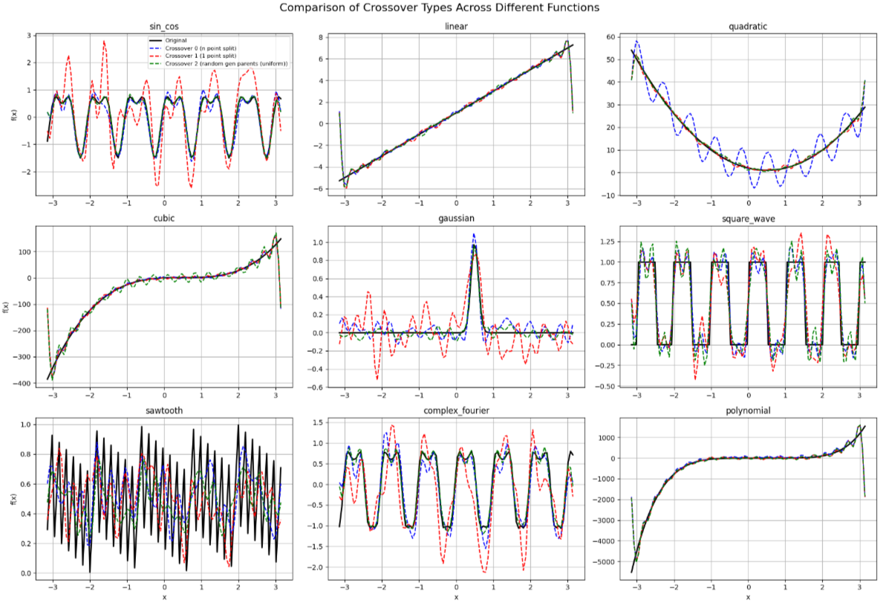

# Genetic-MiniMax
Approximating Fourier Coefficients Using Genetic Algorithm + Implementing Pentago game with MiniMax Algorithm

## 🧬 Part 1: Approximating Fourier Coefficients Using Genetic Algorithm

**Objective:**  
Estimate the Fourier series coefficients of an unknown function using a genetic algorithm.

**Preview** of one of the comparison plots: 

## 🎮 Part 2: Implementing Pentago with Minimax Algorithm

**Objective:**  
Build a playable version of the Pentago game and implement an AI opponent using the Minimax algorithm.

**Game Description**
Pentago is a two-player abstract strategy game where players take turns placing marbles on a 6×6 board divided into four 3×3 quadrants.

After placing a marble, the player rotates one quadrant 90° in either direction.

The goal is to get five of your marbles in a row(horizontally, vertically, or diagonally).

**Minimax Algorithm**
Depth-limited search for agent decision-making.
Alpha-beta pruning to optimize computational efficiency.

**Results**
Compared the effectiveness of alpha-beta pruning at depth 3

---
